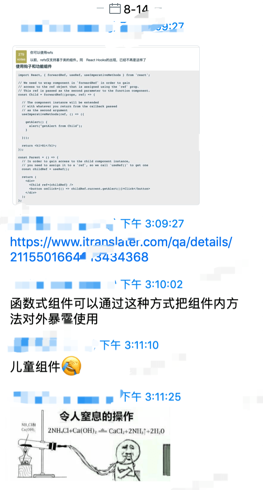
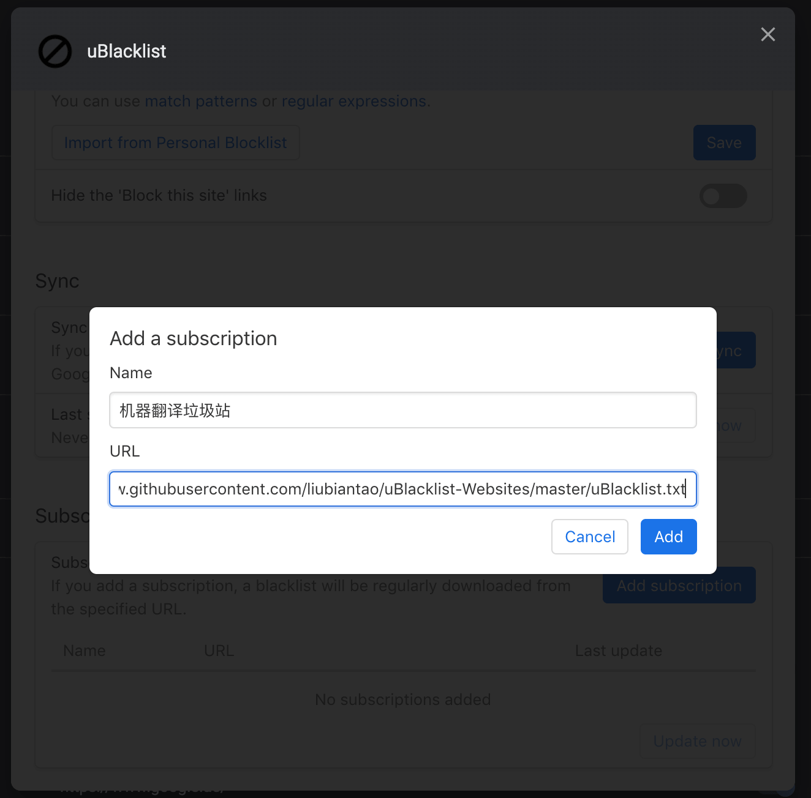
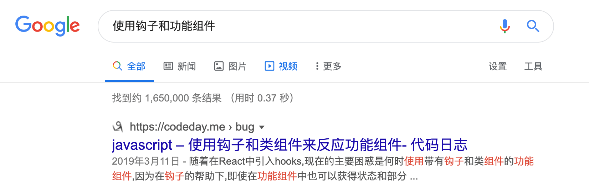
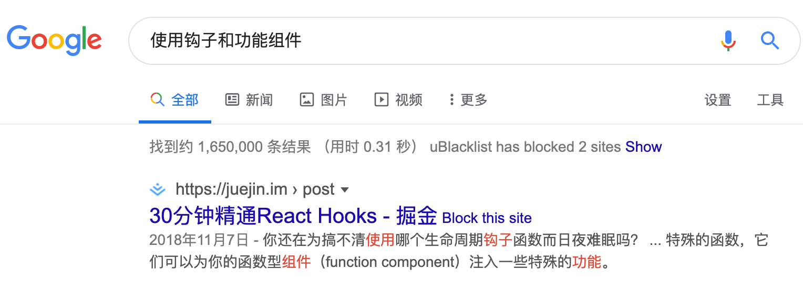

# uBlacklist-Websites
谷歌搜索结果中屏蔽机器翻译网站

## 介绍

事情发生于上周公司企业微信群里的一段对话：

今天搜索过程中又被垃圾站恶心到了，忍无可忍向谷歌点了举报，后来逛 V 站的时候发现了这个好方法，决定维护一个屏蔽列表，大家一起来跟流氓们做斗争。

## 用法

下载插件[uBlacklist - Chrome 网上应用店](https://chrome.google.com/webstore/detail/ublacklist/pncfbmialoiaghdehhbnbhkkgmjanfhe)

在设置中添加 Subscription: https://raw.githubusercontent.com/liubiantao/uBlacklist-Websites/master/uBlacklist.txt

对比一下效果

## 感谢

[google 搜索的时候建议屏蔽这些垃圾网站 - V2EX](https://www.v2ex.com/t/593519)