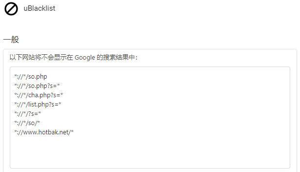

# uBlacklist subscription compilation
> uBlacklist 订阅地址合集

 
[](https://github.com/eallion/uBlacklist-subscription-compilation/issues/new/choose) 

这是一个 uBlacklist 订阅地址合集，搜集了网上大部分的订阅地址合并成一个。  
通过 [Github Actions](https://github.com/eallion/uBlacklist-subscription-compilation/actions) 每周自动更新一次。

本列表**比较激进**！会屏蔽少部分正规但低质量的中文网站。  
所以个人建议搜索中文资料请用百度，uBlacklist 插件对百度无效。
> 如果需要百度屏蔽插件请用：<https://github.com/zhangolve/search-engine-filter>

> 推荐另一个插件：<https://github.com/danny0838/content-farm-terminator>
# 功能

**屏蔽中文内容农场！**【什么是[内容农场](https://zh.wikipedia.org/wiki/%E5%85%A7%E5%AE%B9%E8%BE%B2%E5%A0%B4)？】

通过匹配域名的方式，屏蔽搜索引擎的搜索结果。主要是屏蔽中文 SEO 垃圾站。  

支持的搜索引擎：（由 uBlacklist 插件决定）
- [Google](https://www.google.com/ncr?gws_rd=ssl)
- [Bing](https://www.bing.com/)
- [Brave](https://search.brave.com/)
- [DuckDuckGo](https://duckduckgo.com/)
- [Ecosia](https://www.ecosia.org/)
- [Qwant](https://www.qwant.com/)
- [Startpage](https://www.startpage.com/)
- [Yahoo! JAPAN](https://www.yahoo.co.jp/)
- [Yandex](https://yandex.com/)

# 用法：

### 一、下载 uBlacklist 浏览器插件：
- Chrome: <https://chrome.google.com/webstore/detail/ublacklist/pncfbmialoiaghdehhbnbhkkgmjanfhe>
- Firefox: <https://addons.mozilla.org/en-US/firefox/addon/ublacklist/>
- Edge:<https://chrome.google.com/webstore/detail/ublacklist/pncfbmialoiaghdehhbnbhkkgmjanfhe>
- Safari (macOS / iOS):<https://apps.apple.com/us/app/ublacklist-for-safari/id1547912640>

### 二、设置插件

#### 1. 设置 - 订阅：

> 订阅黑名单列表：

添加订阅：

- `https://git.io/ublacklist`  

<details>
    <summary> <code>完整链接</code> </summary>

```
https://raw.githubusercontent.com/eallion/uBlacklist-subscription-compilation/main/uBlacklist.txt
```

</details>


如下图所示：（先点`添加订阅`）


#### 2. 设置 - 常规：（选填）

> 在谷歌的搜索结果中将不会显示以下网站：

```
*://*/so.php
*://*/so.php?s=*
*://*/cha.php?s=*
*://*/list.php?s=*
*://*/?s=*
*://*/so/*
```
如图：



# 添加/删除 域名

> 少量域名，请在自己浏览器插件的常规设置中添加即可。

本仓库的初衷是收集网上的列表合并，所以不再维护单独的列表`add_url.txt`。  
如有需求添加、删除域名，请至 [eallion/uBlacklist-Subscription](https://github.com/eallion/uBlacklist-Subscription) 提交 PR 或 Issues。  

# 感谢名单：

uBlacklist: 
- [https://github.com/iorate/uBlacklist](https://github.com/iorate/uBlacklist)

Subscription:

> 添加订阅源的时候，各订阅源均采用 Mit License 或无 License。如果有侵权行为，我会第一时间删除。

- [https://github.com/eallion/uBlacklist-Subscription](https://github.com/eallion/uBlacklist-Subscription)
- [https://github.com/arosh/ublacklist-stackoverflow-translation](https://github.com/arosh/ublacklist-stackoverflow-translation)
- [https://github.com/cobaltdisco/Google-Chinese-Results-Blocklist](https://github.com/cobaltdisco/Google-Chinese-Results-Blocklist)
- [https://github.com/dallaslu/penzai-list](https://github.com/dallaslu/penzai-list)
- [https://github.com/DivineEngine/uBlacklist](https://github.com/DivineEngine/uBlacklist)
- [https://github.com/gyli/Blocklist](https://github.com/gyli/Blocklist)
- [https://github.com/h-matsuo/uBlacklist-subscription-for-developer](https://github.com/h-matsuo/uBlacklist-subscription-for-developer)
- [https://github.com/iorate/ublacklist-example-subscription](https://github.com/iorate/ublacklist-example-subscription)
- [https://github.com/littleserendipity/uBlacklist-Subscription](https://github.com/littleserendipity/uBlacklist-Subscription)
- [https://github.com/liubiantao/uBlacklist-Websites](https://github.com/liubiantao/uBlacklist-Websites)
- [https://github.com/nonPointer/uBlacklist-Subscription](https://github.com/nonPointer/uBlacklist-Subscription)
- [https://github.com/scyrte/uBlacklist-Subscription](https://github.com/scyrte/uBlacklist-Subscription)
- [https://github.com/xNathan/uBlacklist-subscription](https://github.com/xNathan/uBlacklist-subscription)
- [https://github.com/yangjingchuang/ublacklist-subscription](https://github.com/yangjingchuang/ublacklist-subscription)
- [https://github.com/YeSilin/uBlacklist](https://github.com/YeSilin/uBlacklist)


# [LICENSE](https://github.com/me-shaon/GLWTPL)
```
GLWT（祝你好运）公共许可证
版权所有（C）每个人，除了作者

任何人都被允许复制、分发、修改、合并、销售、出版、再授权或
任何其它操作，但风险自负。

作者对这个项目中的代码一无所知。
代码处于可用或不可用状态，没有第三种情况。


                祝你好运公共许可证
            复制、分发和修改的条款和条件

0 ：在不导致作者被指责或承担责任的情况下，你可以做任何你想
要做的事情。

无论是在合同行为、侵权行为或其它因使用本软件产生的情形，作
者不对任何索赔、损害承担责任。

祝你好运及一帆风顺。
```
