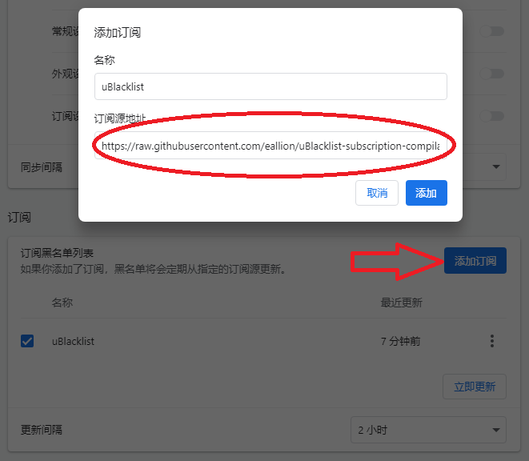

# uBlacklist subscription compilation

> uBlacklist 订阅地址合集


[](https://github.com/eallion/uBlacklist-subscription-compilation/issues/new/choose) 

> 订阅源地址：`https://git.io/ublacklist`  

这是一个 uBlacklist 插件的订阅地址合集，搜集了网上大部分的订阅地址合并成一个。  
通过 [Github Actions](https://github.com/eallion/uBlacklist-subscription-compilation/actions/workflows/go.yml) 每周自动更新一次。

### 功能

#### 🧱 **屏蔽中文内容农场！**

【什么是[内容农场](https://zh.wikipedia.org/wiki/%E5%85%A7%E5%AE%B9%E8%BE%B2%E5%A0%B4)？】

通过匹配域名的方式，屏蔽搜索引擎的搜索结果。  
主要是屏蔽中文 SEO 垃圾站，如机器翻译、AI 生成的内容……  

#### 🔍️ 支持的搜索引擎（由 [uBlacklist](https://github.com/iorate/ublacklist) 插件决定）

此扩展支持以下搜索引擎

|              | Web                | Images             | Videos             | News               |
| ------------ | ------------------ | ------------------ | ------------------ | ------------------ |
| Google       | :heavy_check_mark: | :heavy_check_mark: | :heavy_check_mark: | :heavy_check_mark: |
| Bing         | :heavy_check_mark: | :heavy_check_mark: | :heavy_check_mark: | :heavy_check_mark: |
| Brave \*3    | :heavy_check_mark: | :heavy_check_mark: | :heavy_check_mark: | :heavy_check_mark: |
| DuckDuckGo   | :heavy_check_mark: | :heavy_check_mark: | :heavy_check_mark: | :heavy_check_mark: |
| Ecosia       | :heavy_check_mark: |                    |                    |                    |
| Kagi         | :heavy_check_mark: | :heavy_check_mark: | :heavy_check_mark: | :heavy_check_mark: |
| Qwant        | :heavy_check_mark: | :heavy_check_mark: | \*1                | :heavy_check_mark: |
| SearX \*2    | :heavy_check_mark: | :heavy_check_mark: | :heavy_check_mark: | :heavy_check_mark: |
| Startpage    | :heavy_check_mark: |                    | :heavy_check_mark: | :heavy_check_mark: |
| Yahoo! JAPAN | :heavy_check_mark: |                    |                    |                    |
| Yandex       | :heavy_check_mark: |                    |                    |                    |

\*1 仅当 "Always play videos on Qwant.com" 关闭时<br>
\*2 仅支持某些公共实例，如果您想将自己的 SearX/SearXNG 添加到支持列表，你需要前往`src/common/search-engines.ts`，并手动将您的搜索引擎添加到列表中，然后手动进行构建。<br>
\*3 由于获取图片链接的完整 URL 比较困难，此扩展程序不支持 Brave Image Search 中按子域名进行拦截。（例如，如果链接指向 `www.example.com`，则会拦截整个 `example.com`）。

### 用法

#### ⬇️ 下载 uBlacklist 浏览器插件

- Chrome: [Chrome Web Store](https://chrome.google.com/webstore/detail/ublacklist/pncfbmialoiaghdehhbnbhkkgmjanfhe)
- Firefox: [Firefox Add-ons](https://addons.mozilla.org/en-US/firefox/addon/ublacklist/)
- Safari (macOS / iOS): [App Store](https://apps.apple.com/us/app/ublacklist-for-safari/id1547912640)
- Edge*: [Chrome Web Store](https://chrome.google.com/webstore/detail/ublacklist/pncfbmialoiaghdehhbnbhkkgmjanfhe)

#### 🔧 设置插件

##### 1. 设置 - 订阅

> 订阅黑名单列表：

添加订阅：

- 订阅源地址：`https://git.io/ublacklist`  

<blockquote>
<details>
    <summary>【👉点击展示】订阅链接内容</summary>
<br />

`https://git.io/ublacklist` 的完整内容如下：

```bash
# curl -I https://git.io/ublacklist

# HTTP/1.1 301 Moved Permanently
# cache-control: public, max-age=31536000, immutable
# x-lru-cache: HIT
location: https://raw.githubusercontent.com/eallion/uBlacklist-subscription-compilation/main/uBlacklist.txt
# content-length: 0
# date: 
# x-github-backend: Kubernetes
# x-github-request-id: 
```

复制订阅长链接：

```bash
https://raw.githubusercontent.com/eallion/uBlacklist-subscription-compilation/main/uBlacklist.txt
```

</details>

</blockquote>

如下图所示：（先点`添加订阅`）



##### 2. 设置 - 常规：（选填）

> 在谷歌的搜索结果中将不会显示以下网站：

```
*://*/so.php
*://*/so.php?s=*
*://*/cha.php?s=*
*://*/list.php?s=*
*://*/?s=*
*://*/so/*
```

屏蔽 AI 内容农场：

> 来自：https://github.com/laylavish/uBlockOrigin-HUGE-AI-Blocklist?tab=readme-ov-file#ublacklist-1

```
/(generative)? *AI *(art|generated|illustration)?/i
/(ada)?Lo(RA|Con) *(model)?|(stable)?.*diffusion|midjourney|niji|sd *(xl|1.5)|(text|txt|img|image) *(to|2) *(image|img|video)/i
```

### 添加/删除 域名

##### 1. 插件设置

少量域名，请在自己浏览器插件的 `常规` 设置中添加即可，在行首添加 `@` 符号可取消屏蔽：

```
# 加入屏蔽
*://*.baidu.com/*

# 取消屏蔽
@*://*.baidu.com/*
```

##### 2. 提交 URL

如有需求添加、删除域名，请至 [eallion/uBlacklist-Subscription](https://github.com/eallion/uBlacklist-Subscription) 提交 PR。  

### 感谢名单

uBlacklist:

- [https://github.com/iorate/uBlacklist](https://github.com/iorate/uBlacklist)

Contribution:

- https://github.com/eallion/uBlacklist-Subscription.git

Subscription:

> 添加订阅源的时候，各订阅源均采用 Mit License 或无 License。如果有侵权行为，我会第一时间删除。

- https://github.com/arosh/ublacklist-stackoverflow-translation.git
- https://github.com/cobaltdisco/Google-Chinese-Results-Blocklist.git
- https://github.com/dallaslu/penzai-list.git
- https://github.com/gyli/Blocklist.git
- https://github.com/h-matsuo/uBlacklist-subscription-for-developer.git
- https://github.com/littleserendipity/uBlacklist-Subscription.git
- https://github.com/liubiantao/uBlacklist-Websites.git
- https://github.com/nonPointer/uBlacklist-Subscription.git
- https://github.com/Paxxs/Google-Blocklist
- https://github.com/xNathan/uBlacklist-subscription.git
- https://github.com/YeSilin/uBlacklist.git
- https://github.com/youzeliang/uBlacklist-Subscription
- https://github.com/zweie/some-rules-for-ublacklist
- https://github.com/laylavish/uBlockOrigin-HUGE-AI-Blocklist

### 推荐

推荐另一个插件：<https://github.com/danny0838/content-farm-terminator>

uBlacklist 插件对百度无效。  
如果需要百度屏蔽插件请用：<https://github.com/zhangolve/search-engine-filter>  

### [LICENSE](https://github.com/me-shaon/GLWTPL)

```
GLWT（Good Luck With That，祝你好运）公共许可证
版权所有© 每个人，除了作者

任何人都被允许复制、分发、修改、合并、销售、出版、再授权或
任何其它操作，但风险自负。

作者对这个项目中的代码一无所知。
代码处于可用或不可用状态，没有第三种情况。


                祝你好运公共许可证
            复制、分发和修改的条款和条件

0 ：在不导致作者被指责或承担责任的情况下，你可以做任何你想
要做的事情。

无论是在合同行为、侵权行为或其它因使用本软件产生的情形，作
者不对任何索赔、损害承担责任。

祖宗保佑。
```
